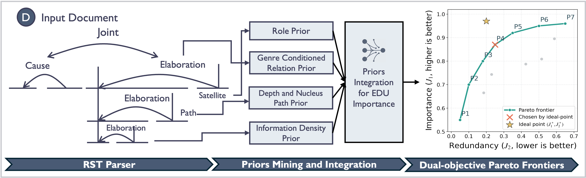

<div align="center">
<h1>RST-Sketch: Rethinking Scalable LLM-based Summarization Beyond Query-Driven Retrieval</h1>

[](https://github.com/DAISYzxy/RST-Sketch)
[](https://github.com/DAISYzxy/RST-Sketch/issues)
[](https://github.com/DAISYzxy/RST-Sketch/pulls)
[](https://github.com/DAISYzxy/RST-Sketch/stargazers)
[](https://github.com/DAISYzxy/RST-Sketch/blob/main/LICENSE)
[](https://github.com/DAISYzxy/RST-Sketch)
</div>




# Contents

- [Introduction](#Introduction)
- [Installation](#Installation)
- [Data](#Data)


# Introduction
We present *RST-Sketch*, a framework that models document organization using Rhetorical Structure Theory (RST) and derives importance signals from structural, positional, lexical, and semantic signals. 
Specifically, RST provides a fine-grained discourse structure that distinguishes central and supporting units, enabling more accurate estimation of content salience.
We further formulate data selection as a dual-objective optimization problem that balances informativeness and redundancy under token constraints, and develop a Pareto frontier based algorithm with theoretical guarantees to address it.


# Installation
To install the cutting edge version of `RST-Sketch` from the main branch of this repo, run:
```bash
git clone https://github.com/DAISYzxy/RST-Sketch.git
cd RST-Sketch
```

To use RST-Sketch, each input document should be firstly processed through the existing RST parser tool, please download the parser by running:
```bash
git clone https://github.com/seq-to-mind/DMRST_Parser.git
```

After parsing the input into RST DT, users can first run `EDU_generation.py` and then perform summarization. Different backbones may require different parameter settings for optimal performance. The provided configuration is tailored for the Llama 2 8B model to support quick testing and easy deployment.


# Data
We release the testing data, including parsed RST DT files, selected EDUs, generated summaries, and QA pairs produced by the retention rate agent, at: [Google Drive link](https://drive.google.com/drive/folders/1RfW_M-z6gMEf5W2mN35bjXhd4IVrv5Jq?usp=sharing).